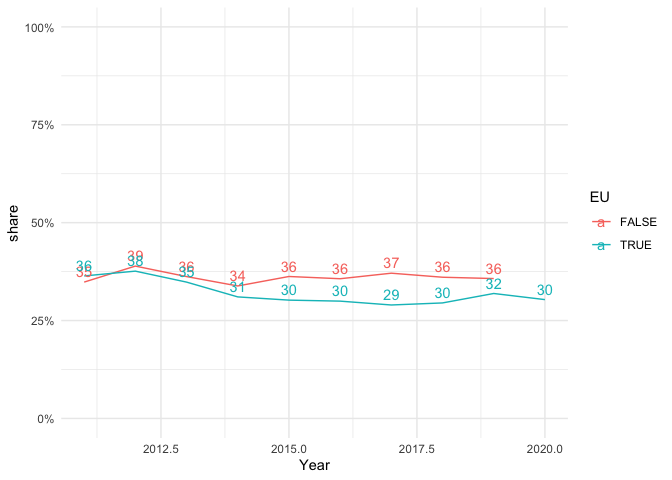

# EUTF for Africa: Comparison with OECD official development aid

**Script by:** [Kira Schacht](https://www.twitter.com/daten_drang)

How does the EU Emergency Trust Fund for Africa fit into the general EU
development spending?

The Organisation for Economic Cooperation and Development (OECD)
collects data on official development assistance donated to developing
countries globally.

The EUTF budget mainly comes from the EU funds specifically set up to
provide such development assistance - especially the European
Development Fund, at least 90% of which are used for official
development assistance (ODA). So while not every project funded through
the EUTF for Africa may be fully eligible as ODA, the vast majority
would be ([see e.g. Knoll & Sherrif 2017,
p. 233](https://www.oecd.org/derec/sweden/201701-ECDPM-rapport.pdf)).

In this analysis, we will compare the EUTF budget with the volume and
regional distribution of official development assistance.

# Files

| Name                                               | Content                                                                |
|----------------------------------------------------|------------------------------------------------------------------------|
| `analysis_oda_comparison/eutf_oda_comparison‚.Rmd` | The main R markdown script. Run in RStudio to reproduce this analysis. |
| `data/...`                                         | Data files                                                             |
| `graphics/...`                                     | Charts that came out of this analysis                                  |

# Data source

Data on official development aid is collected by the OECD Development
Aid Committee (DAC).

The data can be accessed via the [OECD Data
Portal](https://stats.oecd.org/), dataset **DAC3A**(“Aid (ODA)
commitments to countries and regions”) or the [Query Qizard for
International Development Statistics
(QWIDS)](https://stats.oecd.org/qwids/)

The data used here refers to official development aid (ODA) commitments
by donor and recipient, from 2011 to 2020. Data from 2020 are not
complete yet at the time of publication. Values are in in USD millions
(constant 2019 prices).

The version used for this analysis was downloaded on 07. March 2022.

# Analysis

Here is a step-by-step-explanation of the code we used for this
analysis. You can explore it yourself by opening `eutf_scrape.Rmd` in
RStudio.

## Initialize country lists

### Relevant recipient countries and regions

EUTF recipient countries, regions of Africa and total values for Africa

    ##  [1] "Morocco"                     "Algeria"                    
    ##  [3] "Tunisia"                     "Libya"                      
    ##  [5] "Egypt"                       "Burkina Faso"               
    ##  [7] "Cameroon"                    "Chad"                       
    ##  [9] "Côte d'Ivoire"               "Gambia"                     
    ## [11] "Ghana"                       "Guinea"                     
    ## [13] "Mali"                        "Mauritania"                 
    ## [15] "Niger"                       "Nigeria"                    
    ## [17] "Senegal"                     "Djibouti"                   
    ## [19] "Eritrea"                     "Ethiopia"                   
    ## [21] "Kenya"                       "Somalia"                    
    ## [23] "South Sudan"                 "Sudan"                      
    ## [25] "Tanzania"                    "Uganda"                     
    ## [27] "Africa, Total"               "North of Sahara, Total"     
    ## [29] "South of Sahara, Total"      "Southern Africa, Total"     
    ## [31] "Middle Africa, Total"        "Western Africa, Total"      
    ## [33] "Eastern Africa, Total"       "Developing Countries, Total"

### Relevant donor groups

EU countries, EU institutions and overall donor groups for comparison.

    ##  [1] "Official Donors, Total"   "Private Donors, Total"   
    ##  [3] "Multilaterals, Total"     "Non-DAC Countries, Total"
    ##  [5] "DAC Countries, Total"     "EU Institutions"         
    ##  [7] "Austria"                  "Belgium"                 
    ##  [9] "Bulgaria"                 "Croatia"                 
    ## [11] "Cyprus"                   "Czech Republic"          
    ## [13] "Denmark"                  "Estonia"                 
    ## [15] "Finland"                  "France"                  
    ## [17] "Germany"                  "Greece"                  
    ## [19] "Hungary"                  "Ireland"                 
    ## [21] "Italy"                    "Latvia"                  
    ## [23] "Lithuania"                "Luxembourg"              
    ## [25] "Malta"                    "Netherlands"             
    ## [27] "Poland"                   "Portugal"                
    ## [29] "Romania"                  "Slovak Republic"         
    ## [31] "Slovenia"                 "Spain"                   
    ## [33] "Sweden"                   "United Kingdom"

## Read OECD Data

Filter OECD data to display

-   Aid type: Total Commitments (`AIDTYPE == 305`)
-   Amount type: Constant Prices (`DATATYPE == "D"`)
-   Recipient in recipients list (see above)
-   Donor in donors list (see above)

For EU member states Bulgaria and Malta, ODA commitments are not
available disaggregated by recipient country. They are therefore
excluded from this analysis.

Reorganize data by donor category:

-   Official Donors, Total
-   European Union donors:
    -   Germany
    -   France
    -   other EU members
    -   EU institutions
-   other countries (excl. EU members)
-   other multilateral sources (excl. EU institutions)
-   Private Donors, Total

<!-- -->

    ## `summarise()` has grouped output by 'Recipient', 'Donor'. You can override using the `.groups` argument.

    ## `summarise()` has grouped output by 'Recipient'. You can override using the `.groups` argument.
    ## `summarise()` has grouped output by 'Recipient'. You can override using the `.groups` argument.

| Recipient     | Donor   | Year |   Value | EU   |
|:--------------|:--------|-----:|--------:|:-----|
| Africa, Total | France  | 2011 | 4302.54 | TRUE |
| Africa, Total | France  | 2012 | 5966.38 | TRUE |
| Africa, Total | France  | 2013 | 3927.00 | TRUE |
| Africa, Total | France  | 2014 | 3775.76 | TRUE |
| Africa, Total | France  | 2015 | 4199.93 | TRUE |
| Africa, Total | France  | 2016 | 4005.63 | TRUE |
| Africa, Total | France  | 2017 | 4444.22 | TRUE |
| Africa, Total | France  | 2018 | 4033.02 | TRUE |
| Africa, Total | France  | 2019 | 6159.61 | TRUE |
| Africa, Total | Germany | 2011 | 2896.95 | TRUE |

## Aid to africa as share of total aid administered

What share of total development by EU / Non-EU donors goes to Africa?

    ## `summarise()` has grouped output by 'EU', 'Recipient'. You can override using the `.groups` argument.

    ## Warning: Removed 1 row(s) containing missing values (geom_path).

    ## Warning: Removed 1 rows containing missing values (geom_text).

<!-- -->
Around 30-35% of total development aid went to Africa in the past ten
years. That is the case for both EU and Non-EU donors.

## Regional distribution of aid in Africa

Where do EU/Non-EU donors send aid within Africa?

    ## `summarise()` has grouped output by 'EU'. You can override using the `.groups` argument.

The EU & its member states spends most of their aid in Sub-Saharan
Africa, like other donors do too. But they spend more North of the
Sahara than other donors (19%, 5 bn vs 3%, 1.5 bn)

## Official development aid compared to EUTF budget

How large is the EUTF budget (roughly EUR 5 billion) compared to total
ODA commitments by EU members and institutions 2016 to 2020?

Data for 2020 is still preliminary at the time of publication.

    ## `summarise()` has grouped output by 'EU'. You can override using the `.groups` argument.

### EUTF budget as share of ODA per country

Even though the EUTF budget is relatively small compared to overall
development aid commitments, it might still be a substantial share of
overall aid for individual countries.

You can find an overview of EUTF funding per recipient country in our
Google sheets database. The data there has been extracted to
`data/processed/EUTF_recipients_budgets.csv` for this part of the
analysis.

    ## `summarise()` has grouped output by 'Recipient'. You can override using the `.groups` argument.

